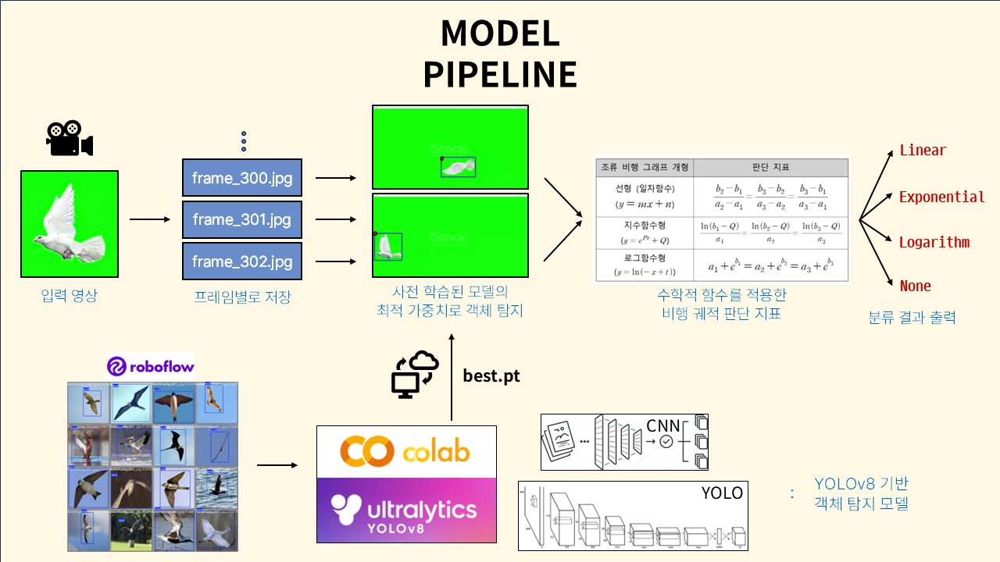

# 2024_YSC
Project for 2024 YSC from GLOBE

## Model Pipeline

## Description
- Final results can be shown in [`/classification/draw_results.py`](classification/draw_results.py)
- [`2024_YSC_Beta.ipynb`](Bird_Detection.ipynb): YOLOv8 Based **Object Detection** Model. GPU needed.
- [`video_preprocess.py`](video_preprocess.py): Converting video to images by frame.
- [`/classfication/`](classification): Classifying trajectory into [linear](classification/linear.py)/[exponential](classification/exp.py)/[logarithm](classification/log.py).
- [`draw_box.py`](draw_box.py): Drawing Bounding Box using object detection results while video playing.
- [`draw_line.py`](draw_line.py): Drawing lines between previous/current/next coordinates while video playing.
- [`draw_trajectory.py`](draw_trajectory.py): Drawing trajectory by leaving trace every 10 frames. & Connecting a line about every coordinates.

## To-Do
- [ ] Unify into single input & output notebook.
- [ ] Add more video dataset.
- [ ] Compare with other models. (ex. DeepLabCut)
- [ ] Build a real miniature.

### &ensp; To-Read
- [ ] [Budgerigars adopt robust, but idiosyncratic flight paths](https://www.hrpub.org/download/20190530/UJCMJ3-12412755.pdf)
- [ ] [Mathematical Modeling of the Flight of the Starlings...](https://www.nature.com/articles/s41598-020-59013-3)

